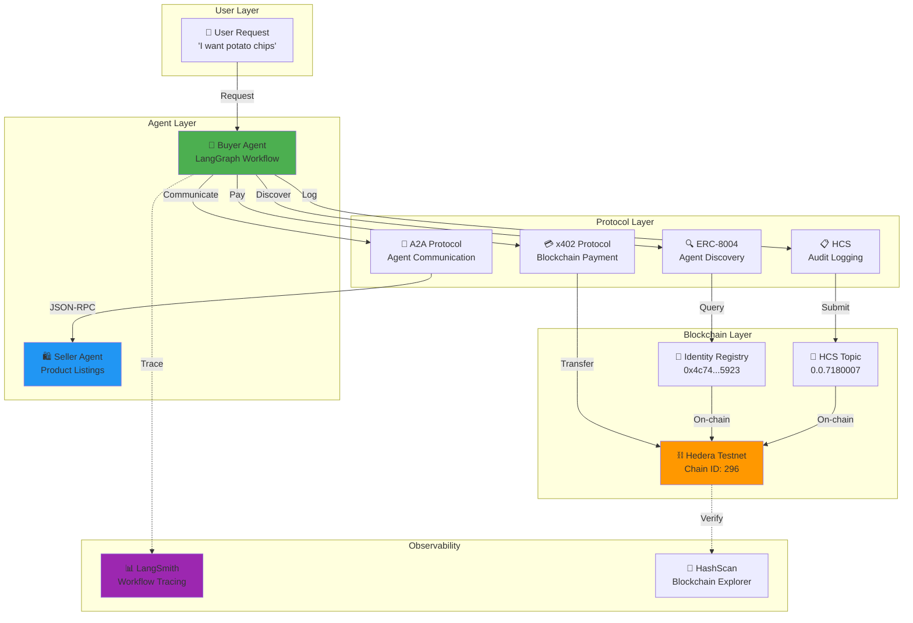
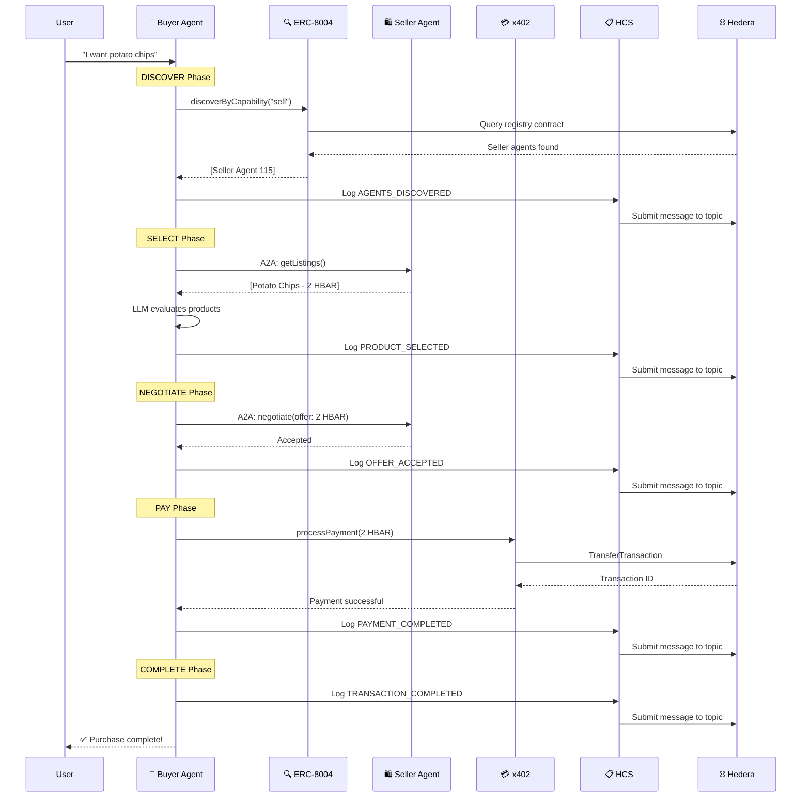
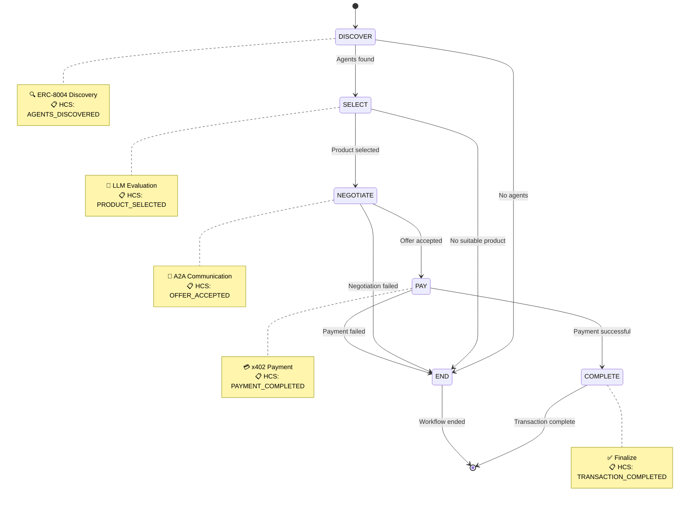
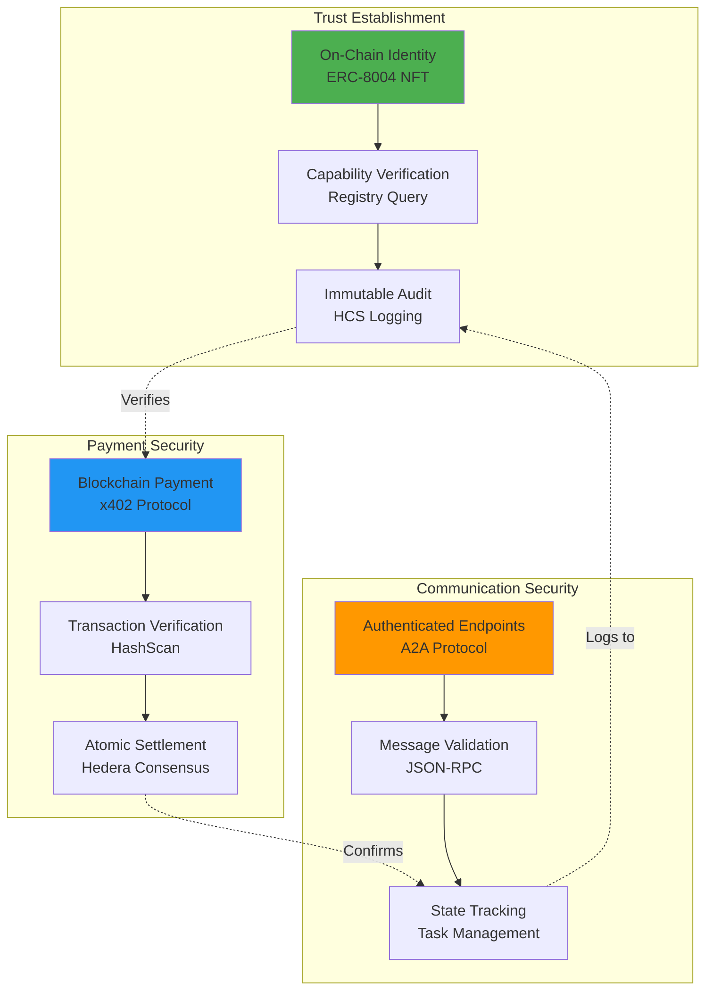
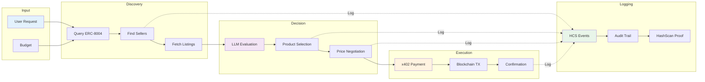
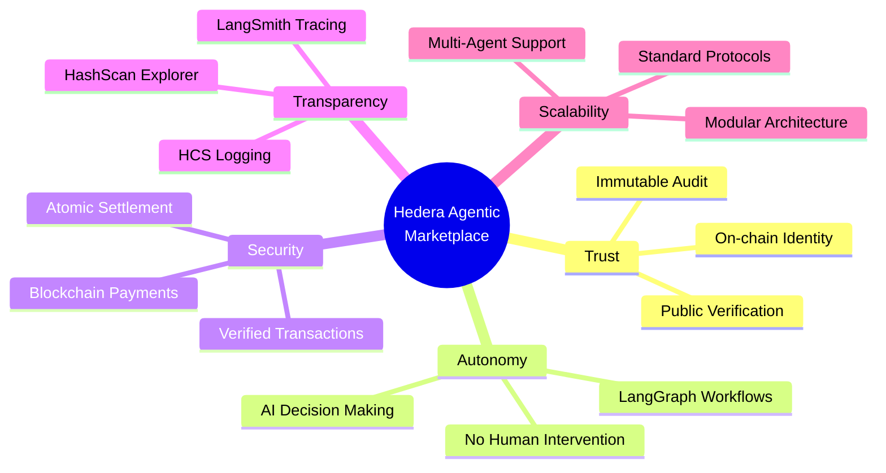
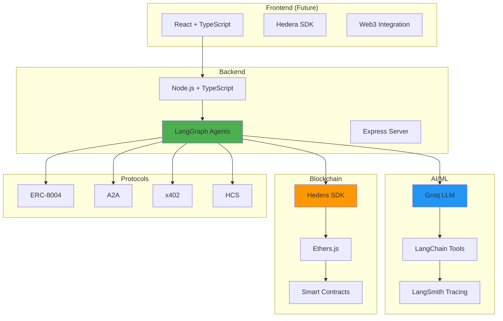
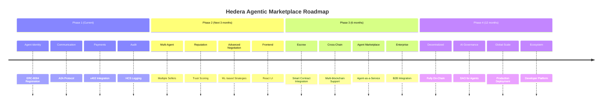

# 🏗️ Hedera Agentic Marketplace - Architecture Diagrams

This document contains Mermaid diagrams for the presentation.

---

## 📊 System Architecture

---

## 🔄 Workflow Sequence

---

## 🧩 Protocol Integration

```mermaid
graph LR
    subgraph "ERC-8004: Agent Identity"
        A1[Agent Registration]
        A2[Capability Registry]
        A3[Discovery Service]
        A1 --> A2 --> A3
    end

    subgraph "A2A: Communication"
        B1[JSON-RPC Server]
        B2[Message Protocol]
        B3[Task Management]
        B1 --> B2 --> B3
    end

    subgraph "x402: Payment"
        C1[Payment Request]
        C2[Hedera Transfer]
        C3[Verification]
        C1 --> C2 --> C3
    end

    subgraph "HCS: Audit Trail"
        D1[Event Logging]
        D2[Topic Messages]
        D3[Immutable Record]
        D1 --> D2 --> D3
    end

    A3 -->|Agents Found| B1
    B3 -->|Agreement| C1
    C3 -->|Success| D1

    style A1 fill:#E3F2FD
    style B1 fill:#F3E5F5
    style C1 fill:#FFF3E0
    style D1 fill:#E8F5E9
```

---

## 🤖 LangGraph Workflow

---

## 🔐 Security & Trust Model

---

## 📊 Data Flow

---

## 🎯 Value Proposition

---

## 📈 Technical Stack

---

## 🚀 Future Roadmap

---

## 📝 Notes for Presentation

### Diagram Usage

1. **System Architecture**: Use for high-level overview (Slide 3)
2. **Workflow Sequence**: Use for detailed walkthrough (Slide 5)
3. **Protocol Integration**: Use for technical depth (Slide 6)
4. **LangGraph Workflow**: Use during demo narration (Slide 7)
5. **Security Model**: Use for trust/security discussion (Slide 8)
6. **Value Proposition**: Use for conclusion (Slide 10)

### Rendering

These diagrams can be:
- Rendered in Markdown viewers (GitHub, VS Code)
- Exported to PNG using Mermaid CLI
- Embedded in presentation slides
- Shown live in browser

### Color Coding

- 🟢 Green: Buyer Agent / Success
- 🔵 Blue: Seller Agent / Communication
- 🟠 Orange: Blockchain / Hedera
- 🟣 Purple: AI/ML / LangSmith

